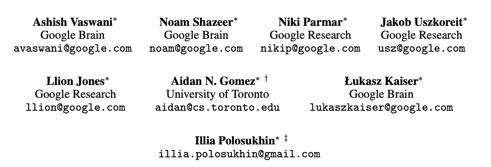
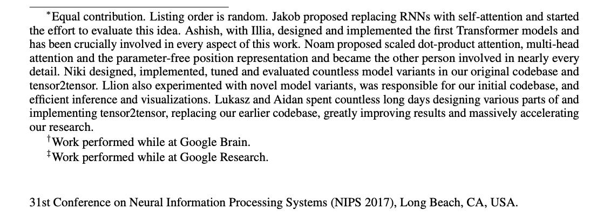
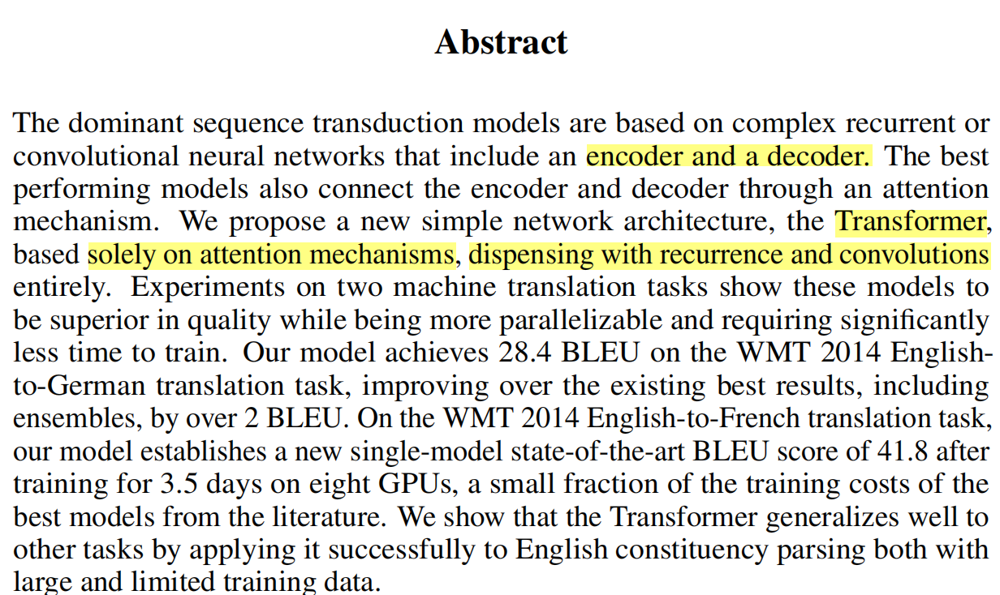
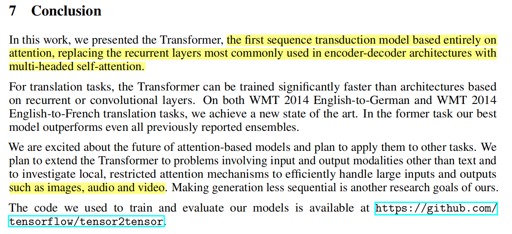
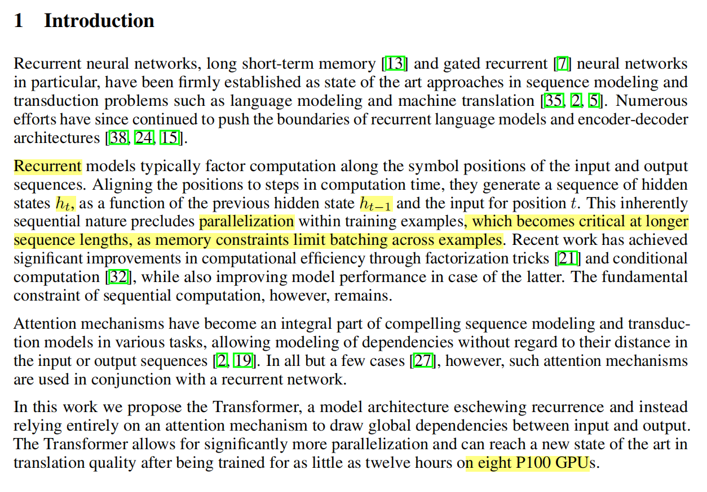
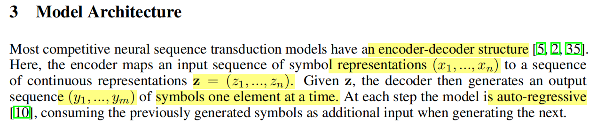
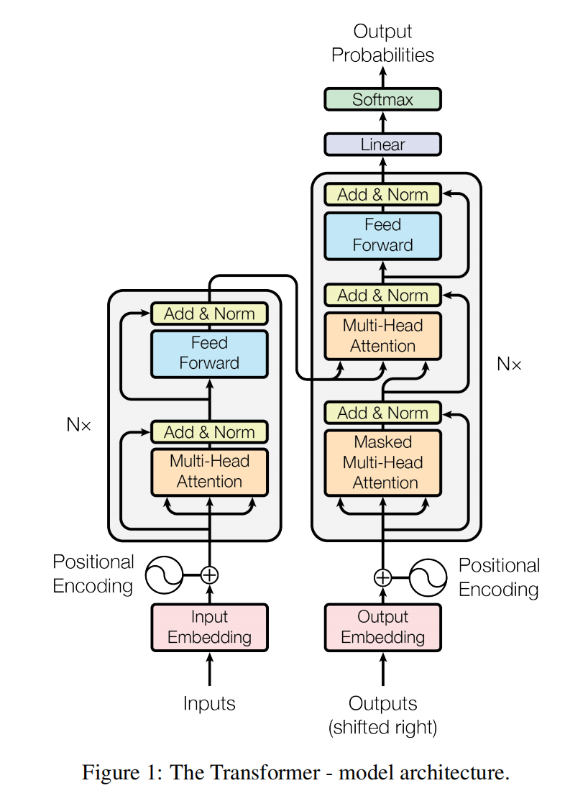
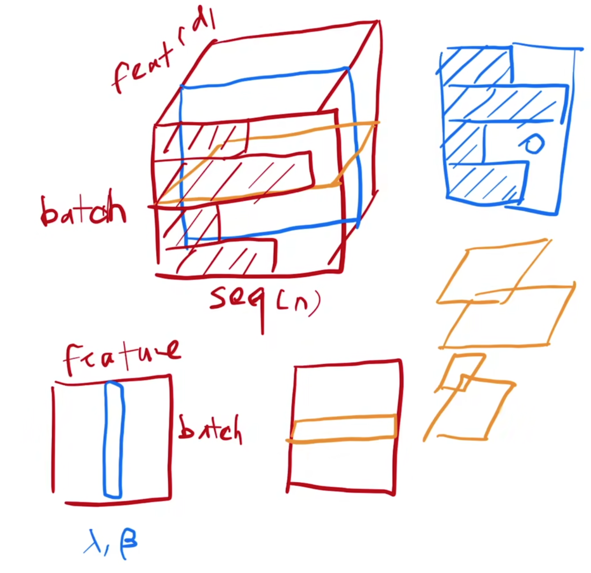

# Attention is all you need
## Paper Reading

### 1. 标题+作者

- **Ashish Vaswani**
- **Noam Shazeer**
- **Niki Parmar**
- **Jakob Uszkoreit**
- **Llion Jones**
- **Aidan N. Gomez**
- **Łukasz Kaiser**
- **Illia Polosukhin**

> *注意：8位作者按照贡献大小随机排序，不存在"第一作者"的概念。*

### 2. 摘要

*Transformer的命名很幸运，未被"变形金刚"所占据。尽管AlexNet的论文本身没有特定名称，但由于其知名度，人们便用第一作者的名字来称呼它。本论文完全基于注意力机制，移除了递归和卷积网络。主要用于机器翻译，并采用BLEU指标进行评估。*

### 3. 结论

*作者提出了一个基于纯粹注意力机制的模型，摒弃了RNN和卷积网络的需求。*

### 4. 导言

- **第一段**: *探讨了使用编码器-解码器结构的LSTM和GRU。*
- **第二段**: *指出了RNN的两大缺点：1) 丢失先前信息，缺乏长期依赖；2) 无法并行计算。尽管有研究通过增大模型中间层来改进，但这会导致更大的内存消耗。*
- **第三段**: *介绍了注意力机构，摒弃了RNN和卷积。*

### 5. 相关工作

*卷积难以建模远距离像素点，而transformer的注意力机制可以一次性观察所有像素点。多头注意力机制模仿了卷积神经网络的多输出通道效果。自主注意力机制并非作者所创，它在此之前就已存在。*

### 6. 模型

*当前最好的翻译模型都基于编码器-解码器结构。解码器在翻译时逐词生成，这个过程称为自回归（auto-regressive）。*

*Transformer模型结构图解*

*Transformer block是模型的核心，包括多头注意力机制和MLP，中间还有残差连接。编码器由6个完全相同的层组成，每个层输出维度固定为512，以简化模型结构。*

*LayerNorm相比于BatchNorm，在每个特征上进行计算，减少了梯度计算的波动。*

### 7. 实验
*内容待补充*

### 8. 评论
*内容待补充*

---

